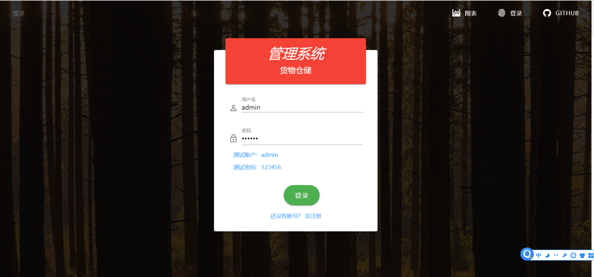
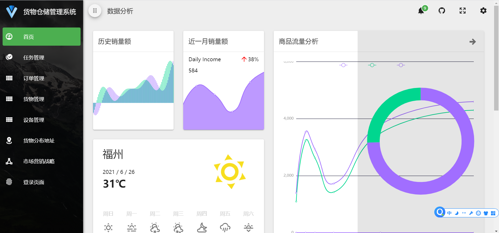
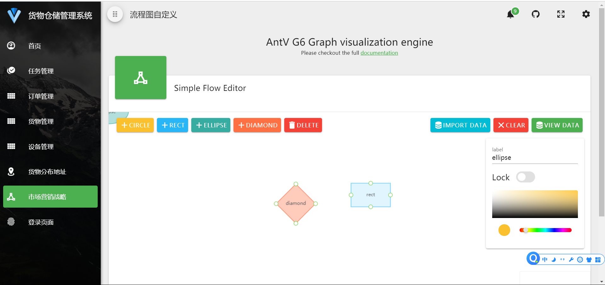

## Vue Material Admin

基于 `Vue + Vuetify + Element-UI` 实现的后台管理系统模板，使用 Material 设计风格，支持响应式移动端，支持颜色主题修改，多语言切换，黑白模式切换


## 目录结构
```              　　
├─ public
├─ tests
├─ src
│  ├─ api  网络请求
│  ├─ assets  图片、css资源
│  ├─ mixins  vue混合
│  ├─ plugins Vuex、组件库插件
│  ├─ router  Vue-Router
│  ├─ styles  样式
│  ├─ views  Vue视图文件
│  ├─ app.Vue 
│  └─ main.js
├─ .browserslistrc
├─ editorconfig
├─ .eslintrc.js
├─ .gitignore
├─ babel.config.js
├─ cypress.json
├─ babel.config.js
├─ LICENSE
├─ package.json
├─ README.md 
├─ vue.config
└─ webpack.config
```

## 功能列表

+ 简单登录

+ Vuetify 部分组件展示

+ echarts 仪表盘

+ 简单的带动画MP3播放器

+ 任务（上拉加载数据和左右菜单布局增加上左右式布局）

+ 简单的流程图编辑器

+ 地图点位聚合效果

    

## 预览地址

+ http://www.timecrush.cn:8008/

## 截图










## 项目运行

### 依赖包安装

```
npm install
```

### 运行项目

```
npm run serve
```

### 打包项目

```
npm run build
```


