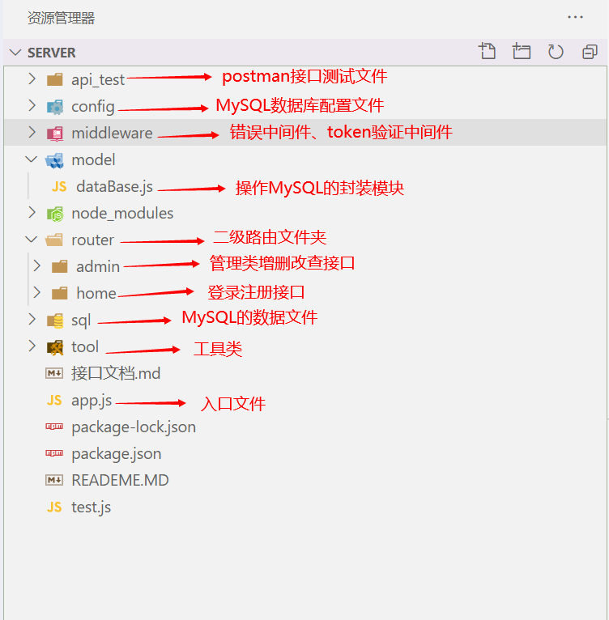

# 一、项目简介

- 一款基于Node.js开发的一套`后端接口框架`，可快速实现对`MySQL`的增删该查和`服务器的搭建`
- 封装的功能如下：
    - Token校验
    - MySQL的连接
    - SQL语句的封装
    - 服务器搭建
    - 用户密码加密
    - RESULT接口规范
    - 错误中间件，token中间件、时间戳格式转换等等

# 二、目录结构说明

# 三、项目运行

1. 更改`config -> default.js`中的MySQL相关配置
2. 执行`npm i `下载所需的第三方包

3. 将`sql文件夹`下的sql文件导入到指定的数据库中
4. 执行`node app.js` 启动服务器
5. 导入`postman测试文件`，测试接口是否可以访问

>注：除了登录注册接口，**其他接口都是基于token进行访问**，所以需要先登录注册后才能访问其他接口
>

