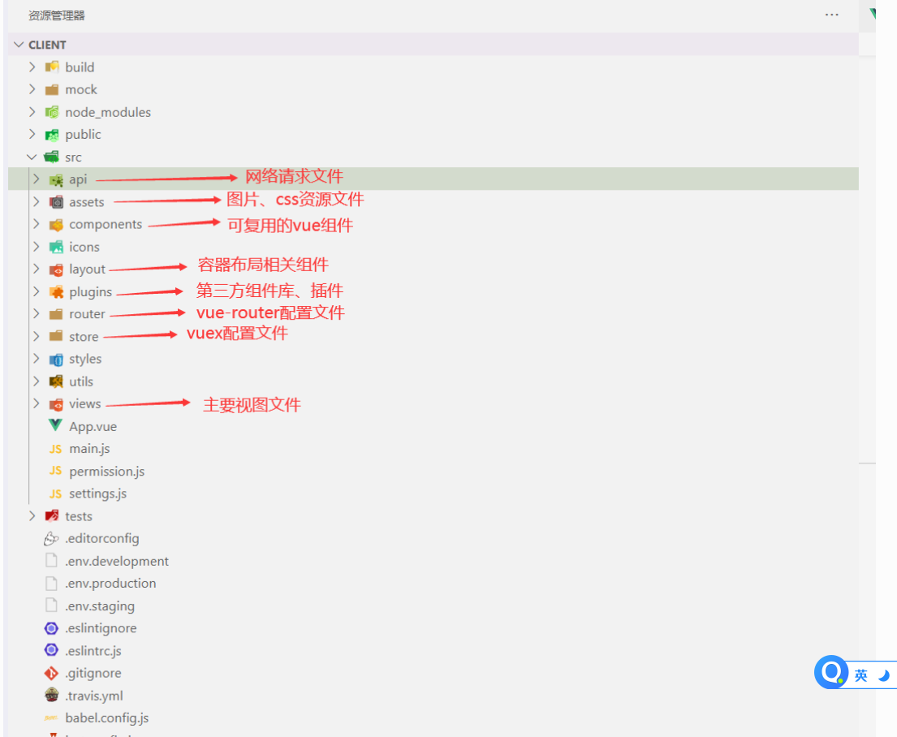
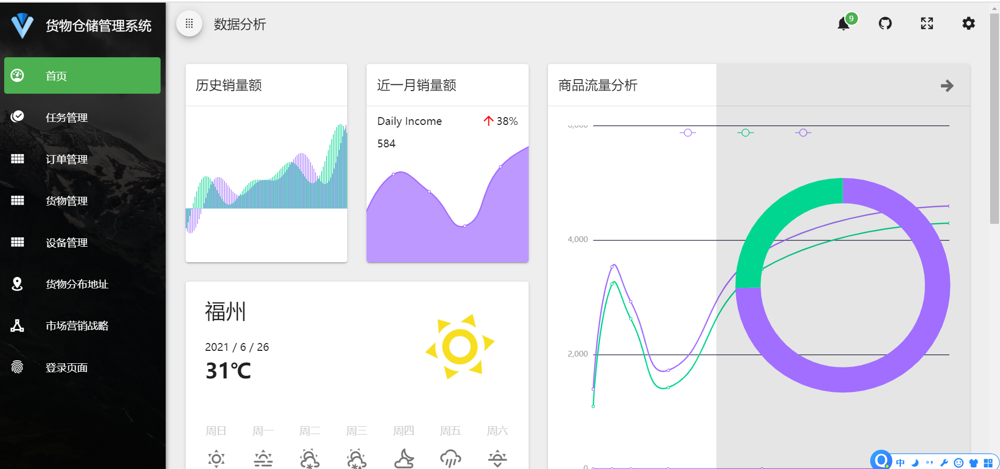
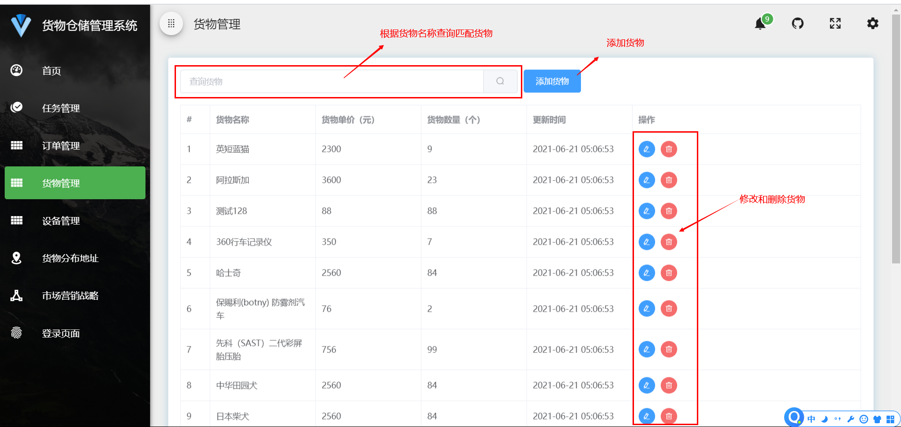
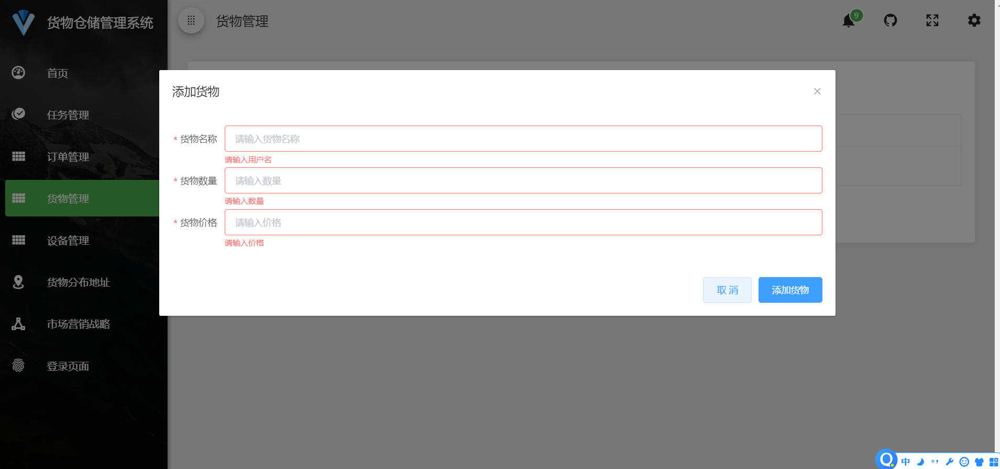
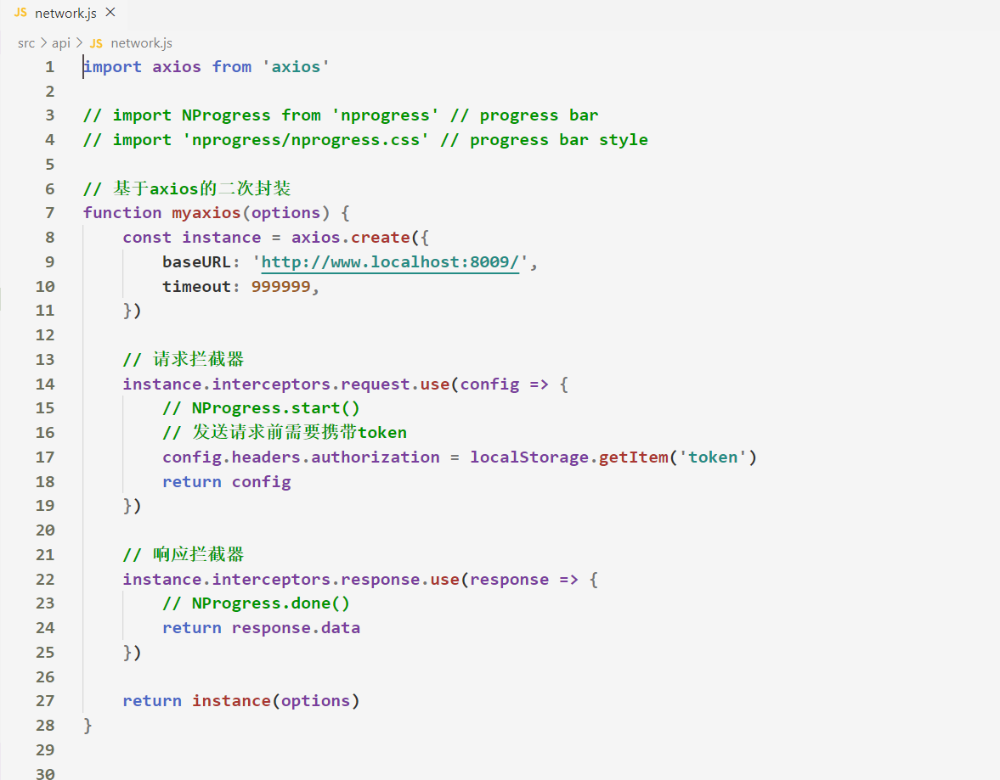

# 货物仓储管理系统

## 一、项目概述

### 1.1 简介

- 前后端分离项目，实现基本的增删该查功能

- `server`：后端项目

- `client`：前端项目

- `test`：postman接口测试数据


>建议启动项目前，先去查看`server 以及 client`文件夹下的 **README.md 文件**，了解该项目
>


### 1.2 技术选型

- 前端 `JavaScript` `H5+C3` `Vue` `Vue-Cli` `Vue-Router` `Axios` `Element-Ui`   

- 后端 `Node` `MySQL` `Token` `Express` `Bcryptjs`

- 接口测试工具： `postman`

    ​    

    

    

    

### 1.3 目录结构说明

- ***前端目录结构说明*** ，更多详情可查看 `client -> README.md`文件

    


- 后端目录结构说明， 更多详情可查看 `serve -> README.md`文件

    


### 1.4 实现功能说明

>**前端**实现功能如下 ，更多详情可查看 `client -> README.md`文件

- 表单校验
- 网络请求二次封装
- 本地存储token
- 订单管理增删该查
- 货物管理增删该查
- 设备管理增删该查
- 仓库分布地址
- echart图表数据展示
- 响应式布局
- 颜色主题更换
- 支持颜色主题修改，多语言切换，黑白模式切换
- 分页数据展示
- 页面切换动画效果
- 视频播放
- 退出登录功能


>**后端**实现功能如下， 更多详情可查看 `serve -> README.md`文件

- 登录注册接口
- token校验
- MySQL数据库的SQL语句封装
- 服务器搭建
- RESULT接口规范
- 订单增删改查接口
- 货物增删改查接口
- 设备增删改查接口
- `postman`接口测试
- 错误中间件、token中间件、时间格式转换等待


## 二、项目运行

### 2.1 运行前端项目

1. 在`client`文件夹中，执行`npm i `命令，下载前端项目所依赖的第三方包
2. 执行`npm run dev`命令，运行基于**Vue-Cli脚手架创建的前端项目**

    


### 2.2 运行后端项目

1. 开启MySQL服务，将`server`文件夹下的`sql`文件夹下的`cargo_stystem.sql`文件运行，导入基本数据表

2. 在`server文件夹  -> config文件夹 -> default.js`中修改MySQL的基本配置

3. 安装Node环境

4. 在`server文件夹`中打开终端命令行窗口，执行`npm i `命令，安装依赖包

5. 执行命令`node app.js`，如果不报错则说明启动成功


### 2.3 接口测试

1. 在`postman`中导入`test`文件夹下的json文件，测试是否能够请求到数据

    


## 三、功能实现

### 3.1 登录


- 登录业务流程 
        ① 在登录页面输入用户名和密码 

    ​	② 调用**后台接口**进行验证 

    ​	③ 通过验证之后，根据后台的**响应状态**跳转到项目主页 


- 代码实现流程
    1. 配置登录页面的前端路由  （Vue-Router）
    2. 绘制登录表单区域   （Elemet UI）
    3. 发送网络请求，验证登录 (Axios)
    4. 将服务器返回的token存储到本地缓存中
    5. 跳转到主页对应的前端路由


### 3.2 主页




### 3.3 增删改查




### 3.4 表单验证




- 代码实现

    - Element UI 提供的`el-form`组件，带有表单验证功能

        


### 3.5 网络请求封装

- 基于axios库的二次网络请求封装

    


### 3.6 组件的抽离

- 将主页中的**头部**、**侧边栏**、**右侧主体区域**的具体代码，抽离到子组件中，增加代码的**可维护性**

- 在views -> home文件夹中新建一个`childHome`文件夹，该文件夹用于存放**Home.vue组件相关的子组件**

    - ```
        ├── views
        │   ├── home
        │   	└── childHome
        |   	└── Home.vue
        ```

        


